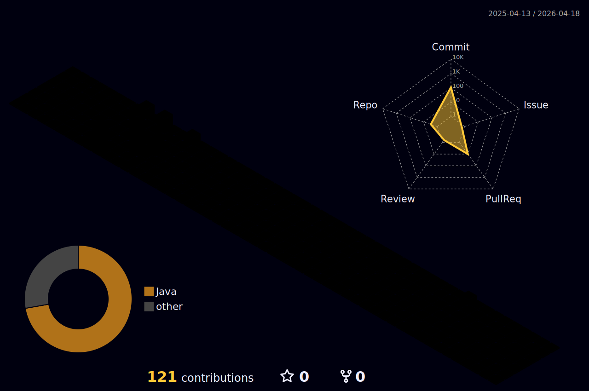

# Conecte-se com V@llzin (Valmilson Lucena)

## Formação

- Estudante de ADS (Análise e Desenvolvimento de Sistemas) Unifanor Wyden. ✔️
- Formado em Tecnologia de Construção de Edifícios Unifanor Wyden. ✔️

## BootCamps

    
     
     
     

## Visualizações

  <a href="https://github.com/vallzin">
      <!--
   
       -->
      

 

## Status GitHub

  <a href="https://github.com/vallzin">
      
        
      
  </a> 

<!--

 

-->

## Habilidades   📚 ✒️ ✏️
<!--
### Linguagens de Marcação e Estilo

  
-->
### Linguagens de Programação

<!--    
-->
### Bibliotecas e Frameworks

<!--   
 --> 

### Banco de Dados

### Sistema Operacional

<!--  -->

### Ferramentas
<!--
 
-->

 
##
           
<!--
        
-->

## Minhas Contribuições

#
### Feito com 

</img>

